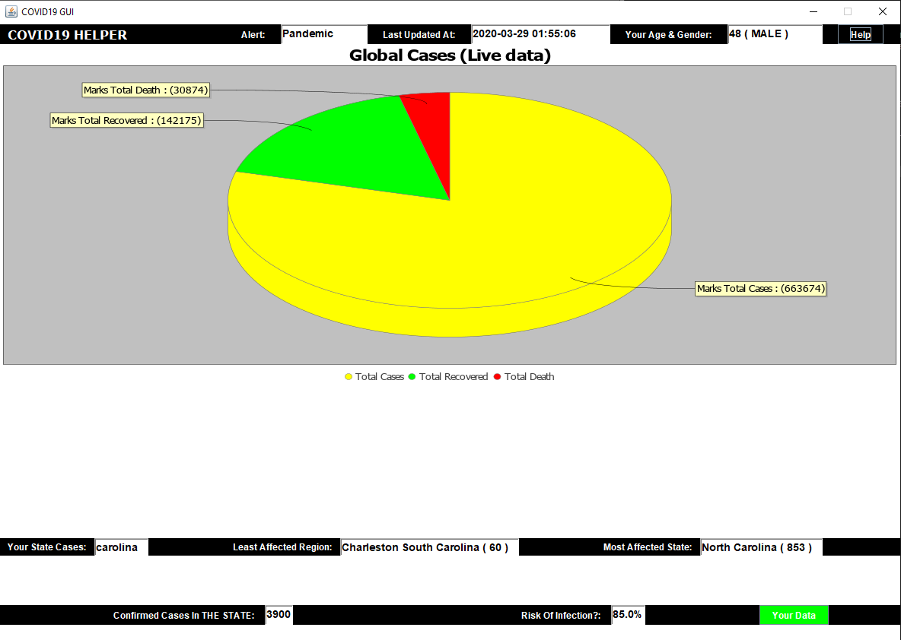

### Background- Simply a tool to query the status of COVID19 using my own Grammar, Lexer and builtin Parsers** 

This was done as an assignment for a university project, by using builtin lexers and parsers given to us. My work contains the language specificaiton and grammars that I've defined. Read more to find the relevant contents.

I wanted to make something interesting, and so the only idea came to me was to make something related to the ongoing pandemic.
So I've gone ahead and built a COVID19 tool that shows the infected/casualties/recovered around the world in real-time using the public API by John Hopkins University.

In addition,
I have also included a section where data is displayed for the given state, including least and most affected region. The API in use only supports USA for the time being.

A risk predictor tool that predicts your chance of catching the virus given your age, health conditons, symptoms, latest travels.

**Instructions to play with(change values in .art file)- SEE BELOW**

Change your age
Change the state
Add/remove your health conditons 
Add/remove remove your symptoms 
Add/remove your latest travels 

--For the  last 3 points above make sure that they are defined in the grammer file ( HelpMeWithCovid19.art )

**Requirements**
```
--Java 11 ( I used jdk-11.0.2)

#### Please note - to run this, it requires a .jar file which I am not able to include due to licensing issues. I maybe able to share for valid reasons.  
```
Relevant Files

HelpMeWithCovid19.art 

HelpMeWithCovid19.str

HelpMeWithCovid19.bat -> The main executable file.

Java files: CovidMain is the main class. All other classes in the src dir are also used such as enum and chart files.

All libraries are in the lib folder and I have correctly set their classpath in the bat script

### Language specificaiton
```aidl
{
// Comment

AgeValidator = 38;
YourAge 48
Country "USA"
State "Washington"

//enum property
Gender Male

userHealth uDataHealth{
Diabetic
High_Blood_Pressure
Asthma
}

userSymptoms uDataSymptoms{
Cough
Fever
Shortness_Of_Breath
}

userTravels uDataTravels{
USA
China
Italy
}

HelpMeWithCovid19 uDataTravels;
HelpMeWithCovid19 uDataSymptoms;
HelpMeWithCovid19 uDataHealth;

ConsoleLog("Please be patient, as API in use may have an increased latency!!!");

{
x = 10;
if AgeValidator < 100 doThis
    while x > 0 runThis { ConsoleLog("Executing, please wait... ", x, "\n"); x = x -1; }
}
}
```
Output showing current global state as well data for selected State.

 "# Covid19-Tool" 
